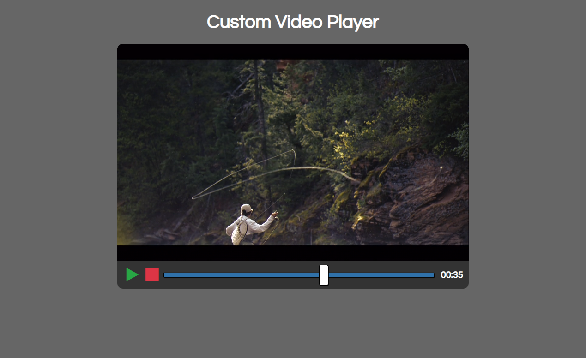
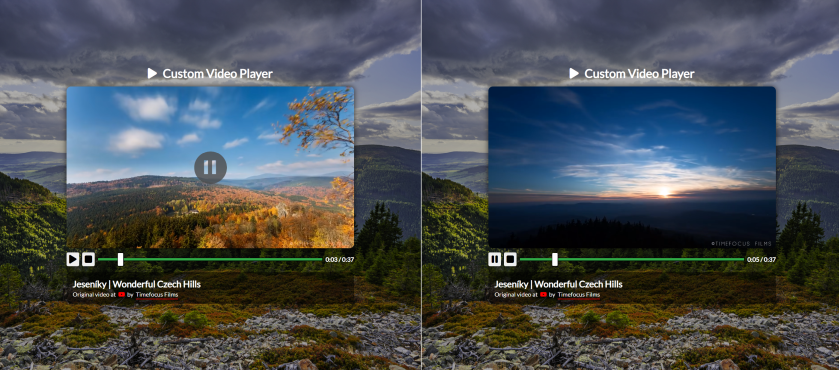

# Udemy--vanillawebprojects-03

**The third** of a series of **20 small projects** in **Vanilla JavaScript** from the [**Udemy course**](https://www.udemy.com/course/web-projects-with-vanilla-javascript/) by author [Brad Traversy](https://www.traversymedia.com/) with this [Brad's original GitHub repository](https://github.com/bradtraversy/vanillawebprojects).

# 03: Custom Video Player

Custom video player using the HTML5 video element and it's JavaScript API with a custom design.

## Project Specifications

- Display custom video player styled with CSS
- Play/pause
- Stop
- Video progress bar
- Set progress bar time
- Display time in mins and seconds

## Original preview

    

## My solution preview

    

## My solution features

- Custom **UI/UX design**
- Added a **PAUSE button** when the video is stopped; after clicking, the video continues.
- Included some **video description** for the current video in the bottom.
- Displayed the **video duration** alongside the current minutes and seconds.

# Author

Website - [Petr Bednarski](https://github.com/pettik)  
Frontend Mentor - [@pettik](https://www.frontendmentor.io/profile/pettik)
